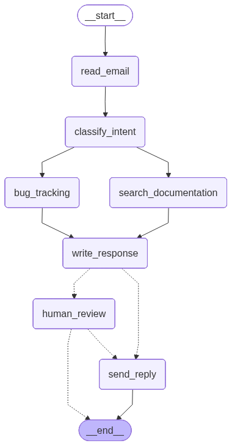
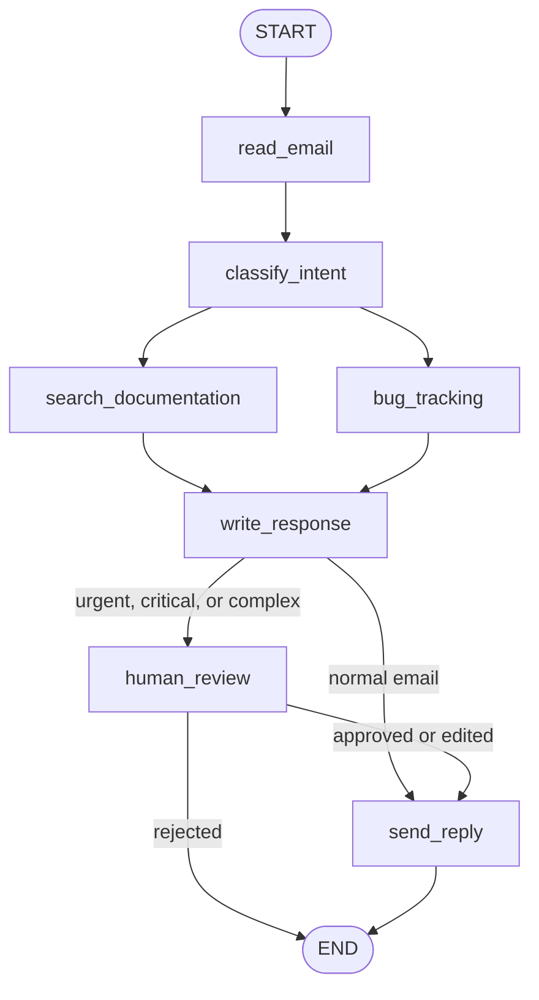

<div align="center">

# AI Email Support Agent

<p>
  
  
  
  
</p>

<p>
  A professional LangGraph email automation project that classifies customer emails,
  gathers context, drafts replies, pauses for approval when needed, and sends the final response.
</p>

</div>

---

## Project Preview

<div align="center">
  
</div>

This graph is generated by the application itself in `test_run.py` with:

```python
graph_png = app.get_graph().draw_mermaid_png()
```

---

## What This Project Does

This project builds an AI-powered customer support email agent using LangGraph. It receives an email, classifies it with Gemini, collects helpful context, creates a response draft, and decides whether the reply can be sent automatically or must be reviewed by a human first.

The current example focuses on a billing complaint:

```text
I was charged twice for my subscription! This is urgent!
```

Because the message is urgent, the graph pauses at the human review step before sending.

---

## Main Features

<table>
  <tr>
    <th align="left">Feature</th>
    <th align="left">Description</th>
  </tr>
  <tr>
    <td><strong>LLM classification</strong></td>
    <td>Uses Gemini through <code>langchain-google-genai</code> to detect intent, urgency, topic, and summary.</td>
  </tr>
  <tr>
    <td><strong>Structured state</strong></td>
    <td>Tracks email content, sender, classification, search results, ticket ID, and draft response in one graph state.</td>
  </tr>
  <tr>
    <td><strong>Parallel workflow branches</strong></td>
    <td>After classification, the graph can search documentation and create a bug ticket before drafting.</td>
  </tr>
  <tr>
    <td><strong>Human approval gate</strong></td>
    <td>High, critical, or complex emails are interrupted for review before sending.</td>
  </tr>
  <tr>
    <td><strong>Checkpoint support</strong></td>
    <td>Uses LangGraph's <code>InMemorySaver</code> so interrupted runs can resume with the same thread ID.</td>
  </tr>
  <tr>
    <td><strong>Graph export</strong></td>
    <td>Generates <code>graph.png</code> so the workflow can be visualized in the README.</td>
  </tr>
</table>

---

## Workflow

The agent is organized as a LangGraph state machine.



### Step-by-Step

1. `read_email`
   Receives the raw email state. This is currently a placeholder for future parsing logic.

2. `classify_intent`
   Sends the email content and sender address to Gemini and returns a structured classification:

   ```python
   {
       "intent": "billing",
       "urgency": "high",
       "topic": "duplicate subscription charge",
       "summary": "Customer says they were charged twice."
   }
   ```

3. `search_documentation`
   Builds a search query from the classification. The current implementation returns mock documentation results, but this is where a vector database, support knowledge base, or API search can be connected.

4. `bug_tracking`
   Creates a placeholder bug ticket ID using `uuid`. This is ready to be replaced with Jira, Linear, GitHub Issues, Zendesk, or another ticketing system.

5. `write_response`
   Builds a response prompt using the email, classification, documentation, and optional customer history. It then drafts a customer-ready reply.

6. `human_review`
   Uses LangGraph `interrupt()` to pause execution when the email is high urgency, critical, or complex. A human can approve the draft, edit it, or reject it.

7. `send_reply`
   Prints the final reply. This is the integration point for a real email provider such as Gmail, Outlook, SendGrid, or a support desk API.

---

## Project Structure

```text
D:\my-app
|-- graph.png                 # Generated visual graph used in this README
|-- langgraph.json            # LangGraph app configuration
|-- requirements.txt          # Python dependencies
|-- run_output.md             # Saved output from a sample test run
|-- test_run.py               # End-to-end demo script
|-- my_agent
|   |-- __init__.py
|   |-- agent.py              # Graph construction and compilation
|   `-- utils
|       |-- __init__.py
|       |-- nodes.py          # Graph node functions
|       |-- state.py          # Typed state definitions
|       `-- tools.py          # Reserved for future helper tools
`-- venv                      # Local virtual environment
```

---

## Core Files

### `my_agent/agent.py`

Builds the LangGraph workflow:

- Creates a `StateGraph` using `EmailAgentState`.
- Registers all workflow nodes.
- Connects the graph edges.
- Compiles the app with `InMemorySaver`.
- Exposes the compiled graph as `app`.

### `my_agent/utils/state.py`

Defines the state shape shared by all graph nodes.

Important types:

- `EmailClassification`
- `EmailAgentState`

The state includes:

- `email_content`
- `sender_email`
- `email_id`
- `classification`
- `ticket_id`
- `search_results`
- `customer_history`
- `draft_response`

### `my_agent/utils/nodes.py`

Contains the actual workflow logic:

- `read_email`
- `classify_intent`
- `search_documentation`
- `bug_tracking`
- `write_response`
- `human_review`
- `send_reply`

### `test_run.py`

Runs the graph end to end with a sample urgent billing email, saves the graph image, handles the human review interrupt, resumes the graph, and writes the output to `run_output.md`.

---

## Requirements

- Python 3.11 or newer
- A Google Gemini API key
- Installed dependencies from `requirements.txt`

Dependencies:

```text
langgraph
langchain-google-genai
python-dotenv
```

---

## Setup

Create and activate a virtual environment:

```powershell
python -m venv venv
.\venv\Scripts\Activate.ps1
```

Install dependencies:

```powershell
pip install -r requirements.txt
```

Create a `.env` file in the project root:

```env
GOOGLE_API_KEY=your_google_api_key_here
```

The code loads this file automatically with `python-dotenv`.

---

## Run the Demo

```powershell
python test_run.py
```

Expected behavior:

1. The script generates `graph.png`.
2. It sends the sample email into the LangGraph app.
3. The agent classifies the email.
4. The agent drafts a reply.
5. Because the email is urgent, execution pauses for human approval.
6. The test script resumes the graph with approval.
7. The final response is sent.
8. A markdown log is written to `run_output.md`.

---

## Sample Output

From the included `run_output.md`:

```text
Status: Waiting for human review
```

Draft response:

```text
Subject: Re: Urgent: Double Charge for Subscription!

Dear Customer,

Thank you for reaching out. I understand this is urgent, and I apologize
for the concern caused by the double charge for your subscription.

We are actively investigating the duplicate charge on your account immediately.
```

After approval:

```text
Status: Email sent successfully
```

---

## Running With LangGraph

The project includes `langgraph.json`:

```json
{
  "dependencies": ["."],
  "graphs": {
    "email_agent": "./my_agent/agent.py:app"
  },
  "env": ".env"
}
```

This tells LangGraph where to find the compiled graph and which environment file to load.

If you have the LangGraph CLI installed, you can run the graph with:

```powershell
langgraph dev
```

---

## Human Review Logic

The approval gate is controlled inside `write_response`.

```python
needs_review = (
    classification.get("urgency") in ["high", "critical"]
    or classification.get("intent") == "complex"
)
```

If `needs_review` is true, the graph routes to `human_review`. Otherwise, it routes directly to `send_reply`.

The `human_review` node pauses with:

```python
human_decision = interrupt({...})
```

Then it resumes based on the human decision:

- `approved: True` sends the response.
- `edited_response` replaces the draft before sending.
- `approved: False` ends the graph so a human can handle the email manually.

---

## How to Extend This Project

<table>
  <tr>
    <th align="left">Area</th>
    <th align="left">Current Version</th>
    <th align="left">Professional Upgrade</th>
  </tr>
  <tr>
    <td>Email input</td>
    <td>Manual test state</td>
    <td>Connect Gmail, Outlook, IMAP, Zendesk, or Intercom</td>
  </tr>
  <tr>
    <td>Documentation search</td>
    <td>Mock search results</td>
    <td>Use a vector database such as Chroma, Pinecone, Weaviate, or pgvector</td>
  </tr>
  <tr>
    <td>Ticketing</td>
    <td>Generated UUID ticket</td>
    <td>Create tickets in Jira, Linear, GitHub Issues, or Zendesk</td>
  </tr>
  <tr>
    <td>Sending email</td>
    <td>Prints to terminal</td>
    <td>Send through Gmail API, Microsoft Graph, SendGrid, or customer support platform</td>
  </tr>
  <tr>
    <td>Memory</td>
    <td>In-memory checkpointer</td>
    <td>Use SQLite, Postgres, Redis, or another persistent LangGraph checkpointer</td>
  </tr>
  <tr>
    <td>Testing</td>
    <td>One demo script</td>
    <td>Add unit tests for classification routes, review behavior, and node outputs</td>
  </tr>
</table>

---

## Current Limitations

This is a strong starter project, but several parts are intentionally placeholders:

- `read_email` does not parse real email headers yet.
- `search_documentation` returns mock results.
- `bug_tracking` creates a fake ticket ID.
- `send_reply` prints the reply instead of sending an email.
- `InMemorySaver` is useful for demos, but production systems need durable persistence.
- The LLM call requires a valid `GOOGLE_API_KEY`.

---

## Professional Workflow Summary

<div>
  <p>
    <strong style="color:#1C7ED6;">Input:</strong>
    Customer email enters the graph.
  </p>
  <p>
    <strong style="color:#7B61FF;">Understanding:</strong>
    Gemini classifies the customer intent and urgency.
  </p>
  <p>
    <strong style="color:#20C997;">Enrichment:</strong>
    The agent gathers documentation and creates tracking context.
  </p>
  <p>
    <strong style="color:#F08C00;">Drafting:</strong>
    The agent writes a professional support response.
  </p>
  <p>
    <strong style="color:#E03131;">Safety:</strong>
    High-risk emails pause for human review.
  </p>
  <p>
    <strong style="color:#2F9E44;">Output:</strong>
    Approved responses are sent to the customer.
  </p>
</div>

---

## Final Notes

This repository is a clean foundation for an AI customer support automation system. It already demonstrates the most important production pattern: combine automation with human approval for sensitive cases. From here, the next best step is to replace the placeholder integrations with real systems while keeping the graph structure stable.
